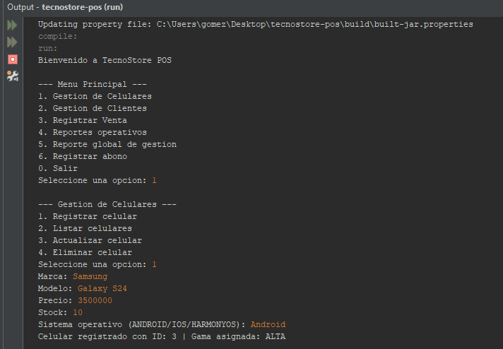

# TecnoStore POS

Console-based point-of-sale system in Java for managing a phone store's catalog, customers, sales, and credit accounts.

---

## Features

- Full CRUD for the phone catalog: brand, model, price, stock, OS and price-based tier assignment
- Customer registration with unique identification enforced at the application and database level
- Sale registration with automatic tier-based discounts (5% low tier, 10% mid tier, none for high tier)
- Credit sales: mark a sale as credit at checkout, then register partial payments (abonos) until the balance reaches zero
- Operational reports: low-stock alerts, top 3 best-selling phones, monthly sales totals, and a plain-text sales report
- Global management report combining total sales, units sold per model, outstanding customer credits, and current stock into a single file
- All monetary calculations use `BigDecimal` throughout, avoiding floating-point rounding errors

---

## Tech stack

- Java 17
- MySQL 8.0 (Aiven Cloud)
- JDBC — MySQL Connector/J 9.7.0
- Apache NetBeans 18, Ant build (`build.xml`)
- Design patterns: Singleton, Factory, Strategy

---

## Setup instructions

1. Clone the repository:

```
git clone https://github.com/jorgegmch/tecnostore-pos.git
cd tecnostore-pos
```

2. Create the database by running the schema script against your MySQL instance:

```
scripts/tecnostore_db_schema.sql
```

The `DROP DATABASE` line at the top is commented out by default — uncomment it only if you want to reset an existing database.

3. Copy the config template and fill in your own credentials:

```
cp src/config.properties.example src/config.properties
```

Then edit `src/config.properties`:

```properties
db.url=jdbc:mysql://HOST:PUERTO/tecnostore_db?ssl-mode=REQUIRED
db.user=USUARIO
db.password=CONTRASENA
```

`config.properties` is never committed to the repository (see `.gitignore`).

4. Run it — either from NetBeans (open the project, right-click `Main.java`, **Run File**), or from a terminal:

```
ant run
```

Both do exactly the same thing: NetBeans's Run button executes the `run` target defined in `build.xml`.

---

## Usage



```
Bienvenido a TecnoStore POS

--- Menu Principal ---
1. Gestion de Celulares
2. Gestion de Clientes
3. Registrar Venta
4. Reportes operativos
5. Reporte global de gestion
6. Registrar abono
0. Salir
Seleccione una opcion: 1

--- Gestion de Celulares ---
1. Registrar celular
2. Listar celulares
3. Actualizar celular
4. Eliminar celular
Seleccione una opcion: 1
Marca: Samsung
Modelo: Galaxy S24
Precio: 3500000
Stock: 10
Sistema operativo (ANDROID/IOS/HARMONYOS): Android
Celular registrado con ID: 3 | Gama asignada: ALTA
```

- **Reportes operativos (4)**: low-stock alerts, top 3 best sellers, monthly sales totals, or generate `reporte_ventas.txt`.
- **Reporte global de gestion (5)**: generates `reporte_global.txt` with total sales, units sold per model, outstanding credits, and current stock — requires no input.
- **Registrar abono (6)**: asks for the sale ID and the amount to pay; rejects amounts greater than the outstanding balance.

---

## Project structure

```
tecnostore-pos/
├── docs/
│   └── console-run.png
├── scripts/
│   └── tecnostore_db_schema.sql
├── src/
│   ├── config.properties.example
│   └── com/tecnostore/pos/
│       ├── Main.java
│       ├── modelo/
│       │   ├── Producto.java              # Abstract base class
│       │   ├── Celular.java               # Extends Producto
│       │   ├── Cliente.java
│       │   ├── Venta.java
│       │   ├── ItemVenta.java
│       │   ├── Credito.java
│       │   ├── CategoriaGama.java         # Enum: ALTA, MEDIA, BAJA
│       │   └── SistemaOperativo.java      # Enum: ANDROID, IOS, HARMONYOS
│       ├── persistencia/
│       │   ├── ConexionDB.java            # Singleton, double-checked locking
│       │   ├── ICelularDAO.java / CelularDAO.java
│       │   ├── IClienteDAO.java / ClienteDAO.java
│       │   ├── IVentaDAO.java / VentaDAO.java   # ACID transaction on sale
│       │   ├── ICreditoDAO.java / CreditoDAO.java
│       │   └── IReporteDAO.java / ReporteDAO.java
│       ├── servicio/
│       │   ├── GestorCelulares.java
│       │   ├── GestorClientes.java
│       │   ├── GestorVentas.java
│       │   ├── GestorCreditos.java
│       │   └── ReporteService.java        # Singleton
│       ├── patron/
│       │   ├── FactoryCelular.java        # Factory: assigns tier by price
│       │   ├── EstrategiaDescuento.java   # Strategy interface
│       │   ├── SinDescuento.java
│       │   ├── DescuentoGamaMedia.java
│       │   ├── DescuentoGamaBaja.java
│       │   └── StrategyDescuento.java     # Strategy context
│       └── util/
│           ├── Validador.java
│           ├── ReporteUtils.java
│           └── ArchivoUtils.java
├── libs/
│   └── mysql-connector-j-9.7.0.jar
└── build.xml
```

---

## Database design

| Table | Description |
|---|---|
| `celulares` | Phone catalog: brand, model, OS, price tier, price, stock |
| `clientes` | Customers, unique by `identificacion`; `correo` and `telefono` are nullable and not unique |
| `ventas` | Sales: customer, date, total |
| `detalle_ventas` | Line items per sale: phone, quantity, subtotal |
| `creditos` | One outstanding balance per credit sale (`UNIQUE` on `id_venta`) |

### Design decisions

- **`CHECK` constraints** enforce `precio > 0`, `stock >= 0` and `cantidad > 0` at the database level, as a safety net independent of the application layer.
- **`correo` and `telefono` are nullable with no `UNIQUE` constraint**, since several customers may legitimately share one (e.g. a family member without their own email or a store account).
- **A credit is tied 1:1 to a sale** (`UNIQUE(id_venta)`): a sale is either paid in full or has exactly one outstanding balance, never several partial records.

---

## Known limitations

- No automated tests.
- No authentication — the app assumes a single trusted operator.
- Sale dates are stored as `DATE`, not `DATETIME`: time-of-day is not tracked.
- Abonos update the balance directly; there is no ledger of individual payments, only the current `saldo_pendiente`.

---

## License

Copyright (c) 2026 Jorge Gomez, Joel Martinez. All rights reserved.

This repository is published for portfolio review. The code may not be copied, modified or redistributed without permission.

Built by [Jorge Gomez](https://github.com/jorgegmch) and [Joel Martinez](https://github.com/JoelSantiagoMP)